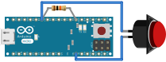

# Button

## `is_pressed`

Returns true when the button is pressed.
Returns false when the button is not pressed.

## `is_bumped`

Returns true when the button's state momentarily changes.
This occurs when the button state changes from open to closed, or
from closed to open.

## Examples

Several examples are available to show how to use this driver.

### Button with Firmata Example
Code for this example can be found in the [`zorg-firmata` repo on GitHub](https://github.com/zorg-framework/zorg-firmata/blob/master/examples/button.py).

**Typical setup:**

- Connect the button between pin 7 (or any other digital pin or your choosing).
- Connect a 10 K Ohm pull-down resistor between ground (GND) and the pin you selected.

