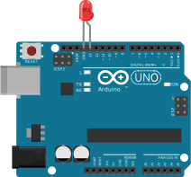

# LED

## `set_state`

_Parameters:_ `state` Should be an integer value of 1 or 0.

Sets the state of the led on or off.

## `is_on`

Returns true if the LED is on, false if the led is off.

## `turn_on`

Turns the LED on.

## `turn_off`

Turns the LED off.

## `toggle`

Toggles the state of the LED. (If the LED is on, then it will be turned off, if
it is off, then it will be turned on.)

## Examples

Several examples are available to show how to use this driver.

### LED with Firmata Example
Code for this example can be found in the [`zorg-firmata` repo on GitHub](https://github.com/zorg/zorg-firmata/blob/master/examples/led.py).

**Typical setup:**

Connect the led between pin 13.

