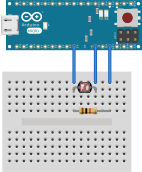

# Light Sensor

## `read`

Returns the raw value from the temperature sensor.

## `has_changed`

Returns true if the sensor value has changed.
Otherwise, returns false.

## Examples

Several examples are available to show how to use this driver.

### Light Sensor with Firmata Example
Code for this example can be found in the [`zorg-firmata` repo on GitHub](https://github.com/zorg-framework/zorg-firmata/blob/master/examples/light_sensor.py).

**Typical setup:**

- Connect the light sensor between analog pin 5 (or any analog pin or your choosing).
- Connect a 10 K Ohm pull-down resistor between ground (GND) and the analog pin you selected.

